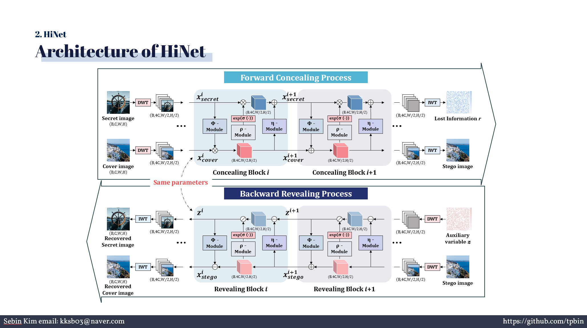
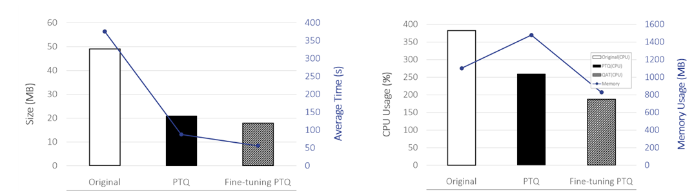
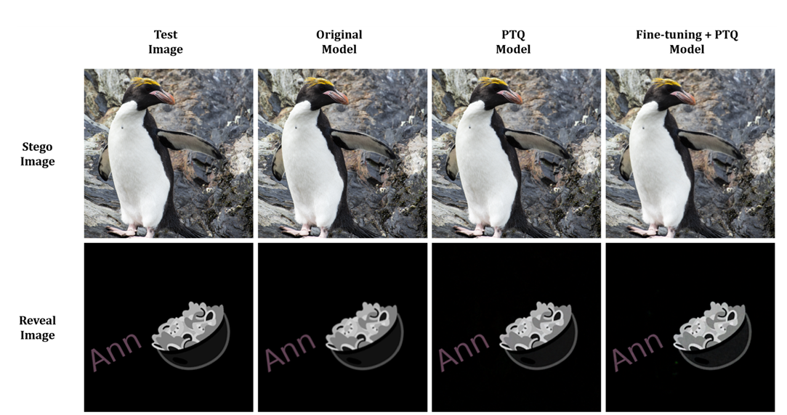

[hinet_README.md](https://github.com/user-attachments/files/22056779/hinet_README.md)
# HiNet: Image Hiding on Raspberry Pi 5 with PTQ

> **엣지 컴퓨팅 환경에서 가역 신경망 기반 HiNet 이미지 은닉 모델 최적화**  
> Raspberry Pi 5 + Post-Training Quantization (PTQ) 적용  

---

## Description

본 프로젝트는 **가역 신경망(HiNet)** 기반 이미지 은닉 모델을 **Raspberry Pi 5**와 같은 엣지 컴퓨팅 환경에서 동작 가능하도록 최적화한 연구입니다.  

주요 목표는 다음과 같습니다:
- **모델 경량화** : Post-Training Quantization(PTQ) 적용  
- **추론 속도 향상** : FP32 대비 INT8 변환으로 효율성 확보  
- **품질·보안 유지** : PSNR, SSIM, AUC 지표로 성능 검증  

---

## System Pipeline

1. Cover + Secret 입력 → Conceal 경로 (stego 생성)  
2. Stego 입력 → Reveal 경로 (cover, secret 복원)  
3. PTQ 적용: Conv2d 레이어 선택적 INT8 변환  
4. Fine-tuning → 도메인 적응 + 성능 손실 최소화  

---

## ⚙️ Environment

| 항목          | 사양 |
|---------------|------|
| Device        | Raspberry Pi 5 (8GB) |
| CPU           | ARM Cortex-A76 Quad-core |
| GPU           | Broadcom VideoCore Ⅶ |
| OS            | Debian GNU/Linux 12 |
| Python        | 3.11.2 |
| PyTorch       | 2.7.4 |
| TorchVision   | 0.22.1 |

---

## Performance

| 모델          | Cover PSNR | Cover SSIM | Secret PSNR | Secret SSIM |
|---------------|------------|------------|-------------|-------------|
| Original      | 45.08 dB   | 0.997      | 46.20 dB    | 0.981 |
| PTQ           | 41.92 dB   | 0.987      | 44.86 dB    | 0.975 |
| Fine-tuned PTQ| 42.65 dB   | 0.991      | 45.37 dB    | 0.980 |

- 모델 크기: **57.3% 감소**  
- 추론 시간: **320초 단축 (약 85% 향상)**  
- AUC(보안 지표): PTQ 대비 Fine-tuning PTQ가 더 안정적  

  
  

---

## Dataset

- 출처: **Watermark Dataset**  
- 용도: HiNet 모델 학습 및 미세조정  
- 전처리: Cover–Secret 이미지 쌍 사용  

---

## Key Features

- **Reversible Neural Network (INN)** 기반  
- **엣지 환경 최적화 (Raspberry Pi 5)**  
- **양자화 기법 (PTQ)** 적용  
- **Fine-tuning + PTQ** → 품질·보안 저하 최소화  
- **PSNR, SSIM, AUC** 기반 성능 평가  

---

## Results

- 모델 크기, 추론 시간, CPU 점유율, 메모리 사용량 **모두 감소**  
- PSNR/SSIM 지표는 **96% 이상 유지**  
- Fine-tuning PTQ 모델이 단순 PTQ보다 **품질·보안성 우수**  
- 엣지 환경에서도 **실시간 저작권 보호 및 프라이버시 기술 적용 가능성** 확인  

---

## License

This project is licensed under the MIT License.

---

## Author

김정훈 (JungHun Kim)  
GitHub: [https://github.com/jj8127](https://github.com/jj8127)  

김세빈 (SeBin Kim)  
정준 (Jun Jeong)  
